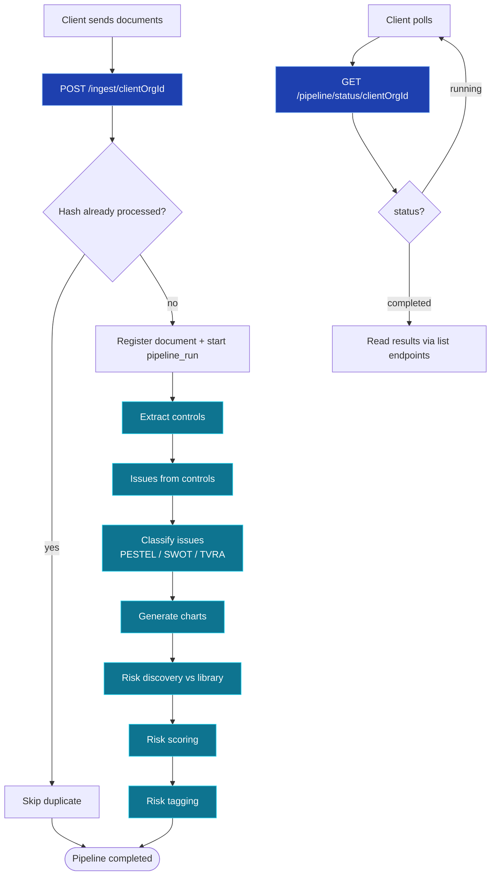
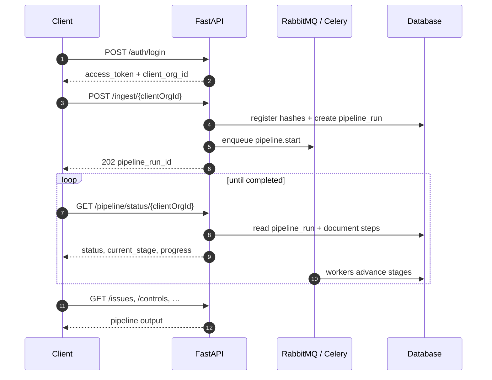
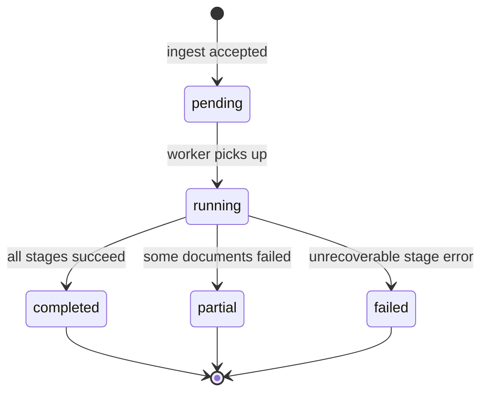

<Note>
**In plain English:** send your documents once. ISO Robot registers them, skips
anything it has already processed, and runs every downstream stage for you — no
manual job triggers, no Postman folder hopping.
</Note>

This is the **recommended integration path** for clients and external systems.
Instead of calling seven separate endpoints in order, you use two:

1. **`POST /ingest/{clientOrgId}`** — deliver documents and start the pipeline.
2. **`GET /pipeline/status/{clientOrgId}`** — poll until the run completes.

Everything between those two calls — control extraction, issue synthesis,
classification, chart generation, risk discovery, risk scoring, and risk tagging —
runs automatically in the background.

## What happens end-to-end



## Pipeline stages (automatic)

Each stage reuses the same domain logic as the manual pipeline. The difference is
that the **orchestrator** chains them — you never call these endpoints yourself
during an ingest run.

| Order | Stage | What it produces |
| --- | --- | --- |
| 1 | **Ingest & dedup** | Document registry rows keyed by `content_hash` |
| 2 | **Extract controls** | Page-referenced `controls` from each document |
| 3 | **Issues from controls** | Synthesised `issues` for the org |
| 4 | **Classify issues** | PESTEL / SWOT / TVRA `issue_classifications` |
| 5 | **Generate charts** | Aggregated chart snapshots (PESTEL, SWOT, TVRA) |
| 6 | **Risk discovery** | `candidate_risks` matched to the seeded risk library |
| 7 | **Risk scoring** | `risk_assessments` (inherent + residual) for org issues |
| 8 | **Risk tagging** | Recommended `risk_tags` (process, function, KPI, region, control family) |

<Info>
Stages after risk tagging — publishing to the Risks Portal, owner assignment, and
chatbot reindex — remain **manual approval steps**. See
[End-to-End Flow](/process/end-to-end-flow) for the full journey including those
stages.
</Info>

## Document storage & deduplication

Every ingested file is fingerprinted with a **SHA-256 hash** before processing
starts. The hash is stored in the document registry scoped to the organisation.

| Scenario | Behaviour |
| --- | --- |
| New document (unknown hash) | Registered and queued for the full pipeline |
| Duplicate hash, already completed | Skipped — returned in `skipped_duplicates[]` |
| Duplicate hash, previous run failed | Re-queued from the failed stage (idempotent resume) |
| `save_to_storage: false` (default) | Metadata + hash stored; file processed in memory / temp only |
| `save_to_storage: true` | File persisted to the org folder (same as legacy upload) |

<Tip>
Use `save_to_storage: false` when you only need analysis output and do not want
files kept on disk. Pass `save_to_storage: true` when you need an audit trail of
the original uploads.
</Tip>

## The two endpoints you need

### 1 · Start — ingest documents

```http
POST /ingest/{clientOrgId}
```

**Auth:** Bearer · **Response:** `202 Accepted`

Multipart form — same file field pattern as the legacy upload endpoint, plus
pipeline options.

| Field | Required | Default | Description |
| --- | --- | --- | --- |
| `file` | Yes | — | One or more files (repeat the field for batches) |
| `save_to_storage` | No | `false` | Persist files to the org document folder |
| `force_reprocess` | No | `false` | Re-run pipeline even if hash was already completed |
| `document_type` | No | — | Free-text classifier (e.g. `policy`) |
| `document_category` | No | — | Framework tag (e.g. `ISO27001`) |
| `document_version` | No | — | Version label |

**Response 202**

```json
{
  "status": "accepted",
  "message": "Pipeline started",
  "data": {
    "pipeline_run_id": "uuid",
    "client_org_id": "uuid",
    "status": "pending",
    "current_stage": "received",
    "documents": {
      "total": 3,
      "queued": 2,
      "skipped_duplicates": 1
    },
    "document_ids": ["uuid", "uuid"],
    "skipped_duplicates": [
      {
        "content_hash": "abc123…",
        "filename": "policy.pdf",
        "reason": "already_processed"
      }
    ]
  }
}
```

Full request/response detail: [Pipeline API](/api-reference/pipeline).

### 2 · Poll — pipeline status

```http
GET /pipeline/status/{clientOrgId}
```

**Auth:** Bearer · **Response:** `200`

Returns the **latest pipeline run** for the organisation — current stage,
per-document progress, and stage-level counters. Poll every few seconds while
`status` is `pending` or `running`.

Optional query params:

| Param | Description |
| --- | --- |
| `pipeline_run_id` | Inspect a specific run instead of the latest |
| `include_history` | Include the last N completed runs |

**Response 200 (excerpt)**

```json
{
  "client_org_id": "uuid",
  "pipeline_run_id": "uuid",
  "status": "running",
  "current_stage": "risk_scoring",
  "progress_percent": 72,
  "started_at": "2026-06-26T10:00:00Z",
  "documents": {
    "total": 5,
    "processed": 3,
    "remaining": 2,
    "skipped_duplicates": 0,
    "failed": 0,
    "items": [
      {
        "document_id": "uuid",
        "filename": "policy.pdf",
        "content_hash": "abc123…",
        "persisted": false,
        "status": "completed",
        "current_stage": "done"
      }
    ]
  },
  "stages": {
    "extract_controls":     { "status": "completed" },
    "issues_from_controls": { "status": "completed", "issues_created": 42 },
    "classify_issues":      { "status": "completed", "classified": 42 },
    "generate_charts":      { "status": "completed" },
    "risk_discovery":       { "status": "completed", "candidates": 18 },
    "risk_scoring":         { "status": "running", "scored": 12, "total": 18 },
    "risk_tagging":         { "status": "pending" }
  }
}
```

## Recommended client flow

<Steps>
  <Step title="Authenticate">
    `POST /auth/login` → save `access_token` and `client_org_id`.
  </Step>
  <Step title="Seed the risk library (once per environment)">
    `POST /risk-library/seed-from-poc` if the library is not already populated.
    Risk discovery in the automated pipeline matches against this catalogue.
  </Step>
  <Step title="Ingest documents">
    `POST /ingest/{clientOrgId}` with your files. Capture `pipeline_run_id`.
  </Step>
  <Step title="Poll status">
    `GET /pipeline/status/{clientOrgId}` every 3–10 seconds until
    `status` is `completed`, `failed`, or `partial`.
  </Step>
  <Step title="Read results">
    Use the existing read endpoints — `GET /controls`, `GET /issues`,
    `GET /classifications/aggregate`, `GET /candidate-risks`,
    `GET /issues/{id}/risk-assessment`, `GET /risk-tags` — to display output.
  </Step>
</Steps>



## Pipeline status values



| `status` | Meaning |
| --- | --- |
| `pending` | Run created; not yet picked up by a worker |
| `running` | At least one stage is in progress |
| `completed` | All stages finished successfully for all queued documents |
| `partial` | Pipeline finished but one or more documents failed |
| `failed` | A stage failed and the run could not continue |

## When to use the legacy manual flow

The per-stage endpoints (`POST /control-documents/extract/{orgId}`,
`POST /issues/from-controls/{orgId}`, etc.) remain available for:

- Debugging a single stage in isolation
- Re-running one step after an analyst edit
- Admin tooling and the API verification Postman collection

For production integrations and webhook-driven ingestion, prefer this automated
pipeline. See [Background Jobs](/process/background-jobs) for how individual job
types map to pipeline stages, and [System Architecture](/process/architecture) for
the Celery + RabbitMQ worker topology.
