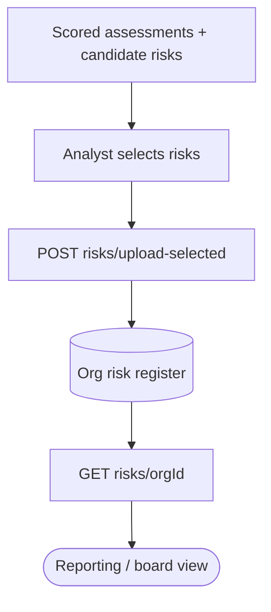
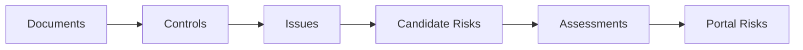

<Note>
**In plain English:** the analyst reviews everything the system found, picks the
risks worth keeping, and publishes them to the official register — the final,
curated list the organisation will act on and report.
</Note>

<CardGroup cols={2}>
  <Card title="Why this stage matters" icon="stamp">
    Human judgment has the final say. The system proposes; the analyst **approves**
    what becomes the register of record.
  </Card>
  <Card title="What you walk away with" icon="folder-check">
    A published, traceable risk register for the organisation — the deliverable.
  </Card>
</CardGroup>

The pipeline's endpoint. After discovery and scoring, an analyst reviews the
results and selects the risks worth carrying forward. This stage **persists those
selections** to the organisation's register and lets you read them back.

## What happens

The analyst submits a curated list of risks — each tied to the issue it came from,
with a title and rating — and the service writes them to the organisation's
`risks` table. The register can then be listed for reporting.



## Inputs & outputs

<table>
  <thead><tr><th>In</th><th>Out</th></tr></thead>
  <tbody>
    <tr>
      <td>`client_org_id` + `selected_risks[]` (issue_id, title, rating)</td>
      <td>Created risk records in the org register</td>
    </tr>
  </tbody>
</table>

## Endpoints used

| Method | Path | Auth | Purpose |
| --- | --- | --- | --- |
| `POST` | `/risks/upload-selected` | Bearer | Persist analyst-selected risks |
| `GET` | `/risks/{orgId}` | Bearer | List the org's published risks |

### Upload request

```json
{
  "client_org_id": "uuid",
  "selected_risks": [
    {
      "issue_id": "uuid",
      "risk_title": "Quarterly access review gaps",
      "risk_rating": "Medium"
    }
  ]
}
```

### Upload response

```json
{
  "status": "success",
  "data": { "created": ["uuid", "uuid"] }
}
```

### List response

```json
{
  "status": "success",
  "message": "Risks retrieved",
  "data": {
    "count": 1,
    "risks": [
      {
        "id": "uuid",
        "client_org_id": "uuid",
        "issue_id": "uuid",
        "risk_title": "Quarterly access review gaps",
        "risk_description": null,
        "risk_rating": "Medium",
        "risk_score": null,
        "submitted_by": null,
        "created_at": "2026-06-12T11:07:57Z",
        "tag_status": "applied",
        "owner_user_id": "uuid",
        "accountable_user_id": null,
        "owner_assignment_status": "assigned",
        "updated_at": "2026-06-12T12:13:14Z",
        "mapped_controls": [],
        "mapped_functions": [],
        "mapped_locations": [],
        "mapped_processes": [],
        "process_tags": [{ "id": "uuid", "name": "Data Management" }],
        "function_tags": [{ "id": "uuid", "name": "Risk Management" }],
        "department_tags": [{ "id": "uuid", "name": "Risk Management" }],
        "kpi_tags": [{ "id": "uuid", "name": "Control testing completion rate" }],
        "region_tags": [{ "id": "uuid", "name": "Global" }],
        "control_family_tags": [],
        "owner": {
          "id": "uuid",
          "name": "Head of Risk Management",
          "email": "head.risk-management@platform.local",
          "title": "Head of Risk Management"
        },
        "accountable": null
      }
    ]
  },
  "errors": []
}
```

<Note>
The list response reflects the *current* state of each risk, including the
results of [Stage 09 · Risk Tagging](/flow/09-risk-tagging) (`tag_status`,
`*_tags`) and [Stage 10 · Risk Owner Assignment](/flow/10-risk-owner-assignment)
(`owner_assignment_status`, `owner`, `accountable`). These fields default to
`"untagged"` / `"unassigned"` / `null` until those stages have run for a risk.
</Note>

<Check>
At this point the full chain is closed: each published risk links to its issue,
each issue to its controls, and each control to a source document page.
</Check>

## The journey, end to end



You started with a folder of policy PDFs and ended with a **scored, traceable,
board-ready risk register** — every number defensible back to a clause on a page.

Full request/response detail: [API Reference → Risks Portal](/api-reference/risks-portal).
