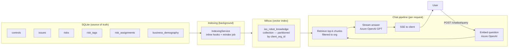
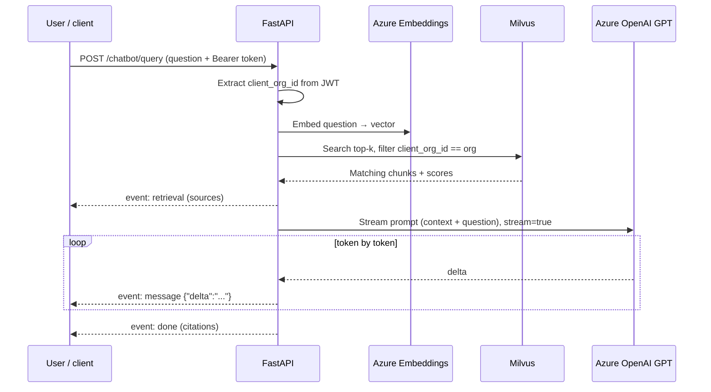

<Note>
**In plain English:** Stage 11 adds a chat interface to everything the pipeline has
built. A user types a question; the system finds the most relevant records from
*their* organisation's data and the AI writes a grounded, cited answer that appears
word-by-word — like ChatGPT, but locked to your org's actual data.
</Note>

## What this stage does

After risks are published (Stage 08), tagged (09), and assigned owners (10), the
organisation has a rich, structured knowledge base: controls, issues, risk ratings,
classifications, owner assignments, and org profile data.

Stage 11 makes that knowledge **conversational**. Users can ask free-form questions
and receive accurate, cited answers — without needing to know which table or screen
holds the answer.

<Columns cols={2}>
  <Card title="What you ask" icon="circle-question">
    "What are my three highest residual risks?" · "Which controls cover data
    protection?" · "Who owns the operational risk cluster?"
  </Card>
  <Card title="What you get back" icon="message-lines">
    A streamed answer grounded in the org's actual records — with citations linking
    back to specific risks, controls, or issues.
  </Card>
</Columns>

## Architecture in one picture



## Tenant isolation guarantee

Every Milvus search is **hard-filtered** to `client_org_id == <caller's org>`. That
value comes exclusively from the server-side JWT — the client never sends it. One
organisation cannot see another organisation's chunks, regardless of what is sent in
the request body.

Milvus stores all orgs in a single collection but physically groups rows by
`client_org_id` using a **partition key**, so searches are both fast and isolated.

## How the knowledge index is populated

### Inline hooks (automatic, incremental)

The indexing service is called automatically after every significant write:

| Write event | What is indexed |
| --- | --- |
| Business demography updated | Org profile chunk |
| Control document extracted | All controls for that org |
| Issue classified | Issue + its PESTEL/SWOT/TVRA classification |
| Issue risk-scored | Issue refreshed with assessment |
| Risk published to register | Published risk chunk |
| Tags applied | Risk re-indexed + tag chunk |
| Owner assigned | Risk re-indexed + assignment chunk |

Inline indexing is **additive and non-breaking** — if Milvus is unreachable, the
original API response still succeeds. The indexing call silently logs and returns.

### Full reindex (on demand)

`POST /chatbot/reindex` wipes the org's entire Milvus partition and rebuilds it from
the current DB. Use this:

- **Once, on first use** — to load data that predates the hooks.
- **After bulk imports or migrations** — to catch anything the hooks missed.

Poll `GET /jobs/{jobId}` until `status = completed`. Typical output:

```json
{
  "by_entity": {
    "org": 1,
    "controls": 48,
    "issues": 30,
    "aggregate": 1,
    "risks": 55,
    "risk_tags": 5,
    "assignments": 2
  }
}
```

## The chunking strategy

Each DB record is first rendered into a **structured, labelled text block** (e.g.
`Risk: <title>\n<description>\nRating: High | Score: 12\nOwner: Jane Doe`). This
ensures the chunk is semantically self-contained before embedding.

Chunks are then sized to **≤ 4 000 characters** with a 300-character overlap on
splits. For most records (controls, risks, issues) this means one record = one chunk.
Long free-text fields split at the character boundary with overlap so nothing is lost.

## How the SSE chat works (step by step)



## What's in the system prompt

The model is instructed to:

1. Answer **only** from the context provided (the retrieved chunks).
2. **Cite** source numbers (e.g. `[1]`, `[3]`) so every claim links to a record.
3. Say **"I don't have that information for this organisation"** if the answer is not
   in the retrieved chunks — never guess or hallucinate.

This keeps answers **grounded and traceable**, matching the traceability principle of
the rest of the pipeline.

## Endpoints

| Method | Path | Purpose |
| --- | --- | --- |
| `GET` | `/api/v1/chatbot/status` | Milvus readiness + org chunk count |
| `POST` | `/api/v1/chatbot/reindex` | Queue a full knowledge rebuild (job) |
| `POST` | `/api/v1/chatbot/query` | Ask a question — SSE stream |

Full endpoint reference: [Chatbot API](/api-reference/chatbot).

## Running in order

<Steps>
  <Step title="Check status">
    `GET /chatbot/status` → confirm `indexing_active: true`. If not, verify
    `AZURE_OPENAI_EMBEDDING_DEPLOYMENT` and that the Milvus container is healthy.
  </Step>
  <Step title="Build the index">
    `POST /chatbot/reindex` (body: `{}`) → save the `job_id` → poll
    `GET /jobs/{jobId}` until `completed` → confirm `org_indexed_chunks > 0` in status.
    This only needs to be done once per org (or after bulk data changes).
  </Step>
  <Step title="Ask questions">
    `POST /chatbot/query` with `{ "question": "..." }`. The response streams
    `retrieval` → `message` tokens → `done` events.
  </Step>
</Steps>

## Frontend integration note

Because native `EventSource` cannot send an `Authorization` header, frontends must
use `fetch` with a `ReadableStream` reader:

```js
const res = await fetch("/api/v1/chatbot/query", {
  method: "POST",
  headers: {
    "Content-Type": "application/json",
    "Authorization": `Bearer ${token}`,
  },
  body: JSON.stringify({ question }),
});

const reader = res.body.getReader();
const decoder = new TextDecoder();
let buffer = "";

while (true) {
  const { value, done } = await reader.read();
  if (done) break;
  buffer += decoder.decode(value, { stream: true });

  for (const frame of buffer.split("\n\n")) {
    const eventLine = frame.split("\n").find(l => l.startsWith("event:"));
    const dataLine  = frame.split("\n").find(l => l.startsWith("data:"));
    if (!eventLine || !dataLine) continue;

    const event = eventLine.replace("event:", "").trim();
    const data  = JSON.parse(dataLine.replace("data:", "").trim());

    if (event === "retrieval") showSources(data.sources);
    if (event === "message")   appendToken(data.delta);
    if (event === "done")      showCitations(data.citations);
    if (event === "error")     showError(data.message);
  }
  buffer = buffer.split("\n\n").pop() ?? "";
}
```

<Tip>
If a reverse proxy (nginx, Caddy, etc.) sits in front of the API, ensure response
buffering is disabled for this endpoint. The API sets `X-Accel-Buffering: no` and
`Cache-Control: no-cache` automatically, but proxy-level buffering must also be off.
</Tip>

## What is not in scope (flagged for later)

- **Server-side chat history** — history is stateless; the client sends prior turns in
  the `history` field. A `chat_sessions` / `chat_messages` table can be added later.
- **Incremental delta reindex** — the current approach is full per-org reindex. A
  bookkeeping table (last-indexed timestamp per entity) can add delta tracking later.
- **Cross-org admin search** — admins see only their org through the query endpoint;
  cross-org search requires a separate admin-scoped endpoint.
