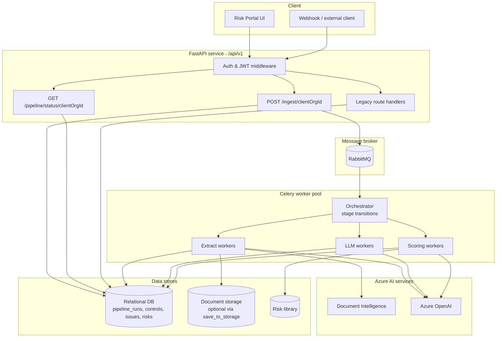

<Note>
**In plain English:** ISO Robot is one API that accepts documents, a message queue
that hands work to background workers, and a database that tracks every step — so
you ingest once and the full risk pipeline runs without manual intervention.
</Note>

ISO Robot is a **FastAPI** service backed by a relational store, orchestrated by
**Celery workers** over **RabbitMQ**, fronted by a React portal, and augmented by
Azure AI services. The defining design choice is that **all heavy work runs
asynchronously** — either as an automated pipeline chain or as individual
background jobs for manual/debug use.

## Component map



## Automated pipeline vs legacy jobs

<AccordionGroup>
  <Accordion title="Automated pipeline (recommended)" icon="bolt">
    **`POST /ingest/{clientOrgId}`** registers documents (by content hash),
    creates a `pipeline_run`, and enqueues the full stage chain. **`GET /pipeline/status/{clientOrgId}`**
    returns org-level progress — current stage, per-document status, and stage
    counters. No per-stage job polling required.

    See [Automated Ingest Pipeline](/flow/00-automated-ingest-pipeline) and
    [Pipeline API](/api-reference/pipeline).
  </Accordion>
  <Accordion title="Legacy background jobs (manual / debug)" icon="gears">
    Individual endpoints still enqueue single-stage jobs via FastAPI
    `BackgroundTasks` (or Celery task wrappers). Callers poll **`GET /jobs/{jobId}`**
    per job. Used by the API verification suite and for re-running one stage in
    isolation. See [Background Jobs](/process/background-jobs).
  </Accordion>
</AccordionGroup>

## Celery task chain

The automated pipeline runs these stages in order. Control extraction parallelises
per document; subsequent stages run org-wide once prerequisites are met.

```mermaid
flowchart LR
    A[ingest.register] --> B[extract_controls]
    B --> C[issues_from_controls]
    C --> D[classify_issues]
    D --> E[generate_charts]
    E --> F[risk_discovery]
    F --> G[score_risks]
    G --> H[risk_tagging]
    H --> I[pipeline.complete]

    classDef stage fill:#0E7490,stroke:#22D3EE,color:#fff
    class A,B,C,D,E,F,G,H,I stage
```



Each task wraps existing domain functions (`run_extract_controls_job`,
`run_issues_from_controls_job`, `classify_issues_job`, `aggregate_classifications`,
`run_risk_discovery`, `score_risks_job`, `run_risk_tagging_job`) — the business
logic is unchanged; only dispatch and orchestration are new.

## Worker queues

| Queue | Tasks | Scale when |
| --- | --- | --- |
| `pipeline.orchestrator` | Start run, stage transitions, status updates | Low (1–2 workers) |
| `pipeline.extract` | Ingest, `extract_controls` | High (PDF / Document Intelligence bound) |
| `pipeline.llm` | Issues, classify, discovery, tagging | High (OpenAI rate limits) |
| `pipeline.scoring` | `score_risks` | Medium |

Workers are **horizontally scalable** — add more Celery processes per queue as
throughput grows. A Redis (or RabbitMQ) result backend stores task outcomes; the
relational DB is the source of truth for pipeline state.

## The layers

<AccordionGroup>
  <Accordion title="API surface (FastAPI, /api/v1)" icon="server">
    A single versioned API. Public routes (`/health`, `/auth/login`,
    `/auth/register`) need no token; everything else requires
    `Authorization: Bearer <token>`. Handlers validate input, enforce org
    ownership, read/write the database, and enqueue Celery tasks (or legacy
    background jobs).
  </Accordion>
  <Accordion title="Document registry & deduplication" icon="fingerprint">
    Every ingested file is hashed (SHA-256). The registry stores
    `content_hash`, org id, optional storage path, and processing status. Duplicate
    hashes that already completed are skipped unless `force_reprocess: true`.
    **`save_to_storage: false`** (default) processes without persisting files to
    disk.
  </Accordion>
  <Accordion title="Azure Document Intelligence" icon="file-magnifying-glass">
    Converts PDFs into layout-aware text with `[PAGE N]` markers so every
    extracted control keeps a **source page**. Falls back to page-batch processing
    or local PDF text extraction when needed.
  </Accordion>
  <Accordion title="Azure OpenAI (JSON chat)" icon="robot">
    Performs judgment work: extracting controls, synthesising issues,
    classifying into PESTEL/SWOT/TVRA, proposing candidate risks, scoring, and
    tagging. All calls return strict JSON. Deterministic heuristics provide
    fallback when the model is unavailable.
  </Accordion>
  <Accordion title="Data stores" icon="database">
    The relational database holds pipeline runs, document registry, controls,
    issues, classifications, candidate risks, assessments, portal risks, and job
    logs. Uploaded files live in per-organisation folders when
    `save_to_storage: true`. A seeded **risk library** is the catalogue that
    discovery matches against.
  </Accordion>
</AccordionGroup>

## Multi-tenancy & ownership

Every meaningful record is scoped to a **client organisation** (`client_org_id`).
Login returns the caller's active org; handlers reject cross-org access with
`403 FORBIDDEN`. Pipeline runs and status queries are always org-scoped.

## Determinism where it matters

The platform deliberately splits **judgment** from **calculation**:

| Concern | Owner | Why |
| --- | --- | --- |
| Qualitative judgments (likelihood, consequence, control effectiveness) | Azure OpenAI | Requires reading and reasoning over text |
| Inherent risk, residual risk, recommended response | Fixed scoring matrices | Must be **repeatable, tunable, and auditable** |

See [Risk Scoring](/flow/07-risk-scoring).

## Base URL

Deployed API (VM):

```text
http://157.20.190.175:8000/api/v1
```

The root health check lives one level up at `http://157.20.190.175:8000/health`.
Full conventions are documented in [API Conventions](/api-reference/conventions).
