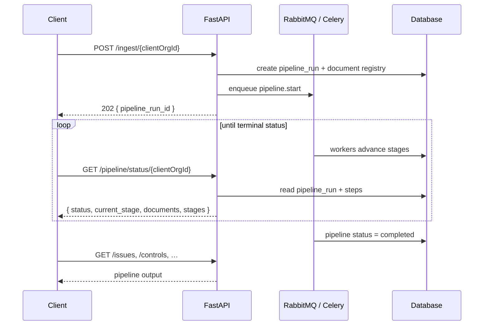
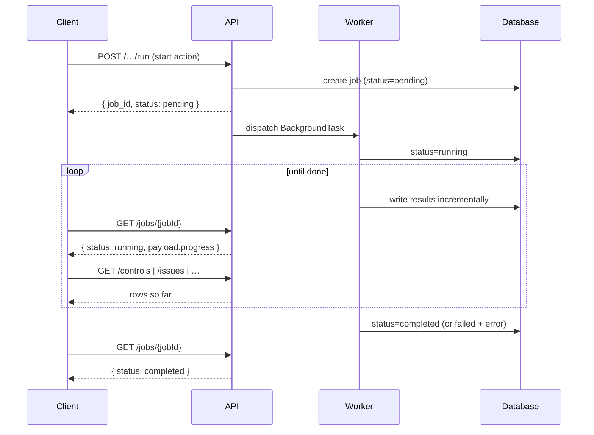
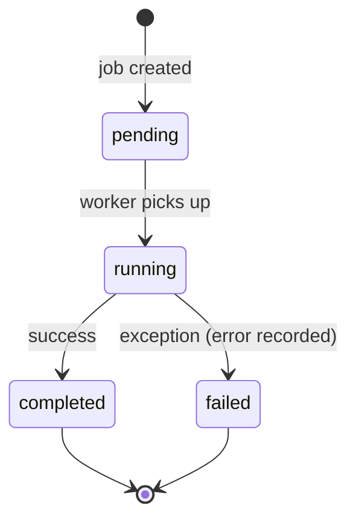
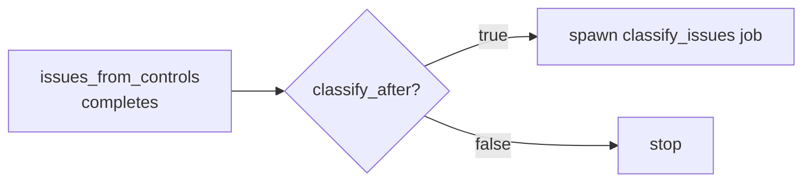

<Note>
**In plain English:** some steps take a while (reading a 200-page PDF, scoring
dozens of risks). Instead of freezing while it works, ISO Robot hands you a
ticket and does the job in the background. You check the ticket until it says
"done," and results appear as they're ready.
</Note>

The expensive parts of the pipeline — parsing PDFs, calling the LLM, scoring risks —
can take seconds to minutes. Rather than block the caller, ISO Robot runs them as
**background work**. There are two patterns:

1. **Automated pipeline** (recommended) — one ingest call chains all stages; poll
   `GET /pipeline/status/{clientOrgId}`. See
   [Automated Ingest Pipeline](/flow/00-automated-ingest-pipeline).
2. **Legacy per-job pattern** — each stage has its own start endpoint; poll
   `GET /jobs/{jobId}` per job. Used for debugging and the API verification suite.

## Automated pipeline pattern

<Steps>
  <Step title="Ingest">
    `POST /ingest/{clientOrgId}` returns **immediately** with a `pipeline_run_id`
    and `202 Accepted`.
  </Step>
  <Step title="Poll status">
    `GET /pipeline/status/{clientOrgId}` until `status` is `completed`, `partial`,
    or `failed`. One call shows every stage and every document.
  </Step>
  <Step title="Fetch data">
    Read results via list endpoints (`/controls`, `/issues`, `/risk-tags`, …).
  </Step>
</Steps>



### Pipeline run status

```json
{
  "pipeline_run_id": "uuid",
  "client_org_id": "uuid",
  "status": "pending | running | completed | partial | failed",
  "current_stage": "extract_controls | issues_from_controls | … | done",
  "progress_percent": 72,
  "documents": {
    "total": 5,
    "processed": 3,
    "remaining": 2,
    "failed": 0,
    "items": [ ]
  },
  "stages": {
    "extract_controls": { "status": "completed" },
    "risk_scoring": { "status": "running", "scored": 12, "total": 18 }
  }
}
```

Full field reference: [Pipeline API](/api-reference/pipeline).

---

## Legacy per-job pattern

Every long-running manual endpoint follows the same three-beat pattern.

<Steps>
  <Step title="Start">
    `POST` the action endpoint. It returns **immediately** with a job in
    `pending` status and a `job_id`.
  </Step>
  <Step title="Poll">
    `GET /jobs/{jobId}` repeatedly until `status` is `completed` or `failed`.
  </Step>
  <Step title="Fetch data">
    Read the result via the relevant list/detail endpoint. Rows often appear
    **while the job is still running**, because workers commit incrementally.
  </Step>
</Steps>



## Job lifecycle



A polled job returns:

```json
{
  "id": "uuid",
  "type": "extract_controls",
  "status": "pending | running | completed | failed",
  "payload": { "progress": { } },
  "error": null,
  "created_at": "…",
  "updated_at": "…"
}
```

<Info>
The `payload.progress` block is updated as work proceeds — for extraction it
reports the current document, segment, and running control count, so a UI can show
a live progress bar.
</Info>

## Job types

These job types map to pipeline stages. In the **automated path** they run
internally as Celery tasks — you do not start them individually. In the **legacy
path** each is started by its own POST endpoint.

| Job type | Pipeline stage | Legacy start endpoint | What it produces |
| --- | --- | --- | --- |
| `extract_controls` | 2 | `POST /control-documents/extract/{orgId}` | `controls` rows from org PDFs |
| `issues_from_controls` | 3 | `POST /issues/from-controls/{orgId}` | `issues` synthesised from controls |
| `classify_issues` | 4 | `POST /issues/classify` (or auto after issues) | PESTEL / SWOT / TVRA classifications |
| `generate_charts` | 5 | *(pipeline only)* | Chart snapshots from `aggregate_classifications` |
| `risk_discovery` | 6 | `POST /risk-discovery/run` | `candidate_risks` matched to the library |
| `score_risks` | 7 | `POST /risk-scoring/run` | `risk_assessments` (inherent + residual) |
| `risk_tagging` | 8 | `POST /risk-tagging/run` | `risk_tags` recommendations |
| `risk_owner_assignment` | — | `POST /risk-assignments/run` | Owner recommendations (manual stage 10) |
| `reindex_org` | — | `POST /chatbot/reindex` | Milvus knowledge index (Stage 11) |

## Chained jobs

Some actions fan out. When issues are generated with `classify_after: true`, the
`issues_from_controls` job marks itself **completed as soon as the issues exist**,
then spawns a **separate** `classify_issues` job so classification can be tracked
independently and never blocks issue creation.



## Resilience

- A single failing item never kills a batch — scoring and extraction log the
  failure and continue with the rest.
- When the LLM or Document Intelligence is unavailable, the pipeline falls back to
  deterministic heuristics where a fallback exists, so the chain still produces
  output.
- Failures are captured in the job's `error` field for inspection.

<Tip>
**Automated vs legacy polling.** Use `GET /pipeline/status/{clientOrgId}` for the
full org pipeline. Use `GET /jobs/{id}` only when you started a single legacy job.
During a run, list endpoints (`/controls`, `/issues`) show what's in the database
right now.
</Tip>
