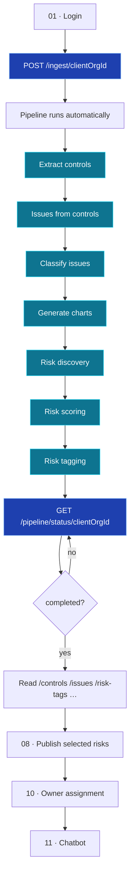
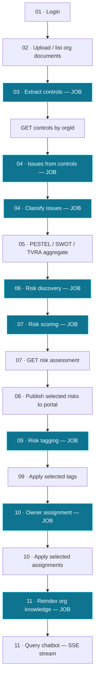

This page is the map. It shows how documents become a scored, tagged risk register,
then covers the optional publish, assign, and chatbot stages.

<Note>
**Read this first.** The **automated ingest path** (two API calls) is the
recommended integration for clients and webhooks. The manual stage-by-stage path
remains available for debugging and analyst workflows.
</Note>

## Automated path (recommended)

One ingest call starts the full pipeline. One status call tracks progress.

Full detail: [Automated Ingest Pipeline](/flow/00-automated-ingest-pipeline) ·
[Pipeline API](/api-reference/pipeline).

### Automated happy path

<Steps>
  <Step title="Log in">
    `POST /auth/login` → save `access_token` and `client_org_id`.
  </Step>
  <Step title="Seed risk library (once)">
    `POST /risk-library/seed-from-poc` if not already done.
  </Step>
  <Step title="Ingest documents">
    `POST /ingest/{clientOrgId}` with files and optional `save_to_storage` flag.
    Capture `pipeline_run_id` from the `202` response.
  </Step>
  <Step title="Poll pipeline status">
    `GET /pipeline/status/{clientOrgId}` every 3–10 s until `status` is
    `completed`, `partial`, or `failed`.
  </Step>
  <Step title="Review output">
    `GET /controls`, `GET /issues`, `GET /classifications/aggregate`,
    `GET /candidate-risks`, `GET /issues/{id}/risk-assessment`, `GET /risk-tags`.
  </Step>
  <Step title="Publish & beyond (manual approval)">
    `POST /risks/upload-selected` → owner assignment → chatbot reindex & query.
  </Step>
</Steps>

---

## Manual path (legacy / debugging)

The original stage-by-stage flow — one POST per job, poll each `job_id` separately.

<Note>
Teal boxes are **background jobs** — start, poll `GET /jobs/{jobId}`, then read
results. See [Background Jobs](/process/background-jobs).
</Note>

### Manual happy path

<Steps>
  <Step title="Log in">
    `POST /auth/login` → save the `access_token` and `client_org_id`.
  </Step>
  <Step title="Confirm documents exist">
    `GET /control-documents/{orgId}` → ensure at least one PDF is uploaded.
  </Step>
  <Step title="Extract controls">
    `POST /control-documents/extract/{orgId}` → poll the job → `GET /controls`.
  </Step>
  <Step title="Generate issues">
    `POST /issues/from-controls/{orgId}` with `classify_after: true` → poll → `GET /issues`.
  </Step>
  <Step title="Review classification charts">
    `GET /classifications/aggregate` once the classify job completes.
  </Step>
  <Step title="Seed library & run discovery">
    `POST /risk-library/seed-from-poc` (once) → `POST /risk-discovery/run` → poll → `GET /candidate-risks`.
  </Step>
  <Step title="Score risks">
    `POST /risk-scoring/run` → poll → `GET /issues/{id}/risk-assessment`.
  </Step>
  <Step title="Tag risks">
    `POST /risk-tagging/run` → poll → `GET /risk-tags`.
  </Step>
  <Step title="Publish">
    `POST /risks/upload-selected` → `GET /risks/{orgId}`.
  </Step>
  <Step title="Chatbot">
    `POST /chatbot/reindex` (once) → `POST /chatbot/query` (SSE stream).
  </Step>
</Steps>

---

## Stage-by-stage summary

<table>
  <thead>
    <tr><th>Stage</th><th>You provide</th><th>You get back</th><th>Automated?</th></tr>
  </thead>
  <tbody>
    <tr>
      <td>[01 Authentication](/flow/01-authentication)</td>
      <td>Username & password</td>
      <td>Bearer token + active org id</td>
      <td>Manual (prerequisite)</td>
    </tr>
    <tr>
      <td>[Automated Ingest](/flow/00-automated-ingest-pipeline)</td>
      <td>Files via `POST /ingest/{orgId}`</td>
      <td>Full pipeline output + `pipeline_run_id`</td>
      <td><strong>Yes — stages 03–09</strong></td>
    </tr>
    <tr>
      <td>[02 Org & Documents](/flow/02-org-documents)</td>
      <td>Org profile + documents (or use ingest)</td>
      <td>Stored documents & demography</td>
      <td>Optional via `save_to_storage`</td>
    </tr>
    <tr>
      <td>[03 Extract Controls](/flow/03-extract-controls)</td>
      <td>Trigger on org PDFs</td>
      <td>Page-referenced controls</td>
      <td>Yes</td>
    </tr>
    <tr>
      <td>[04 Issues](/flow/04-issues)</td>
      <td>Trigger on org controls</td>
      <td>Risk issues (+ classification)</td>
      <td>Yes</td>
    </tr>
    <tr>
      <td>[05 Classifications](/flow/05-classifications)</td>
      <td>Classified issues</td>
      <td>PESTEL / SWOT / TVRA chart data</td>
      <td>Yes</td>
    </tr>
    <tr>
      <td>[06 Risk Discovery](/flow/06-risk-discovery)</td>
      <td>Seeded library + issues</td>
      <td>Candidate risks matched to library</td>
      <td>Yes</td>
    </tr>
    <tr>
      <td>[07 Risk Scoring](/flow/07-risk-scoring)</td>
      <td>Org issues</td>
      <td>Inherent & residual risk assessments</td>
      <td>Yes</td>
    </tr>
    <tr>
      <td>[09 Risk Tagging](/flow/09-risk-tagging)</td>
      <td>Scored issues</td>
      <td>Tag recommendations</td>
      <td>Yes</td>
    </tr>
    <tr>
      <td>[08 Risks Portal](/flow/08-risks-portal)</td>
      <td>Analyst-selected risks</td>
      <td>Published risk register</td>
      <td>Manual approval</td>
    </tr>
    <tr>
      <td>[10 Risk Owner Assignment](/flow/10-risk-owner-assignment)</td>
      <td>Hierarchy + tagged risks</td>
      <td>Accountable owners</td>
      <td>Manual approval</td>
    </tr>
    <tr>
      <td>[11 Chatbot](/flow/11-chatbot)</td>
      <td>A question in plain English</td>
      <td>Streamed, cited answer</td>
      <td>Manual trigger</td>
    </tr>
  </tbody>
</table>

<Tip>
While the automated pipeline runs, poll `GET /pipeline/status/{clientOrgId}` for
org-level progress. You can also re-hit list endpoints (`/controls`, `/issues`) to
watch rows accumulate incrementally.
</Tip>
